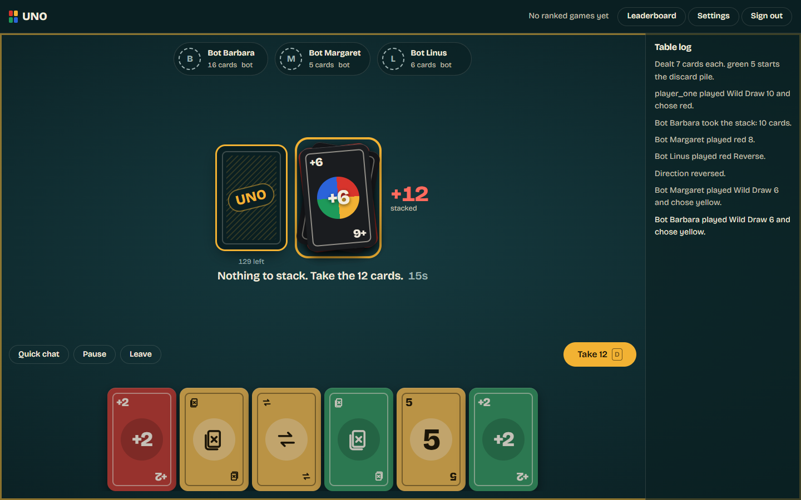
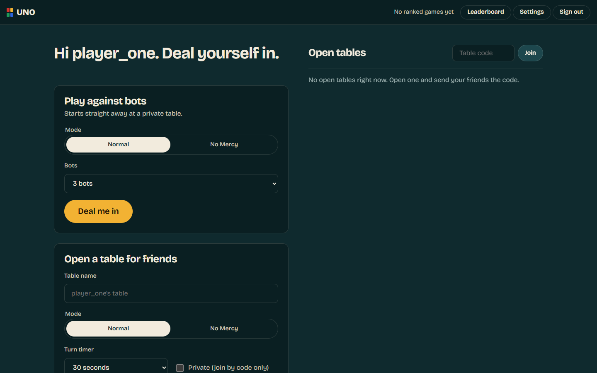
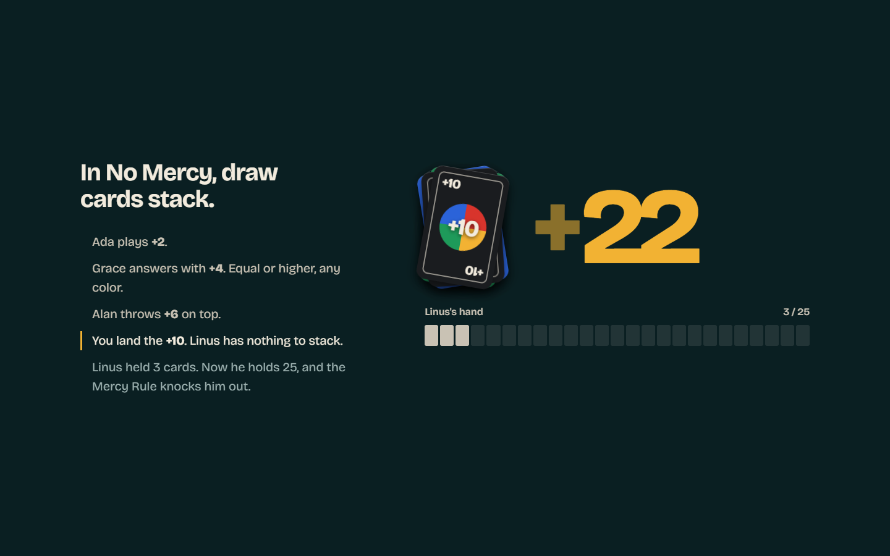
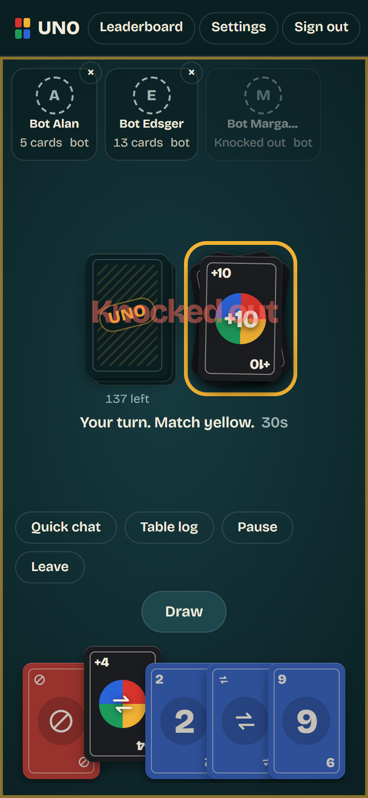

# UNO — Normal &amp; No Mercy

A real-time, browser-based UNO game for 2–10 players, with bots to fill empty seats. Two rule sets: **Normal** (the classic 108-card game) and **No Mercy** (the 168-card deck with stacking draw cards, hand swaps and the 25-card knockout).

Built with Flask, Socket.IO and vanilla JavaScript — no build step, no front-end framework, no CDN.



---

## Contents

- [Features](#features)
- [The two modes](#the-two-modes)
- [House rules and decisions](#house-rules-and-decisions)
- [Quick start](#quick-start)
- [Configuration](#configuration)
- [Deployment](#deployment)
- [Project structure](#project-structure)
- [How it works](#how-it-works)
- [Socket API](#socket-api)
- [Testing](#testing)
- [Security](#security)
- [Accessibility](#accessibility)
- [Upgrading from the first version](#upgrading-from-the-first-version)
- [Contributing](#contributing)
- [License and trademarks](#license-and-trademarks)

---

## Features

- **Two rule sets.** Normal and No Mercy, chosen per table. Every rule is enforced server-side.
- **Multiplayer tables.** 2–10 seats, public tables in the lobby or private tables joined with a code or invite link.
- **Bots.** Fill any seat with a bot, or use *Play against bots* to start a solo game instantly. Bots evaluate their hand, hold wilds back, punish short-handed opponents and sometimes catch you for forgetting to call UNO.
- **Turn timer.** 15, 30 or 60 seconds per table. When it runs out, the server makes a legal move so the table keeps moving.
- **Reconnect-friendly.** Refresh or drop off Wi-Fi and your seat is still there; the game carries on without you until you're back.
- **Host controls.** Pause, resume, remove a player, and start a rematch with the same seats.
- **Stats and leaderboard.** Wins, games and points, ranked separately from games played against bots.
- **Quick chat and sound.** A fixed phrase list (no free text), synthesized sound effects, optional spoken UNO calls.
- **Installable (PWA), keyboard shortcuts, reduced-motion support, and a mobile layout that's designed rather than shrunk.**

| Lobby | Signature scroll on the home page | Phone |
|---|---|---|
|  |  |  |

---

## The two modes

| | Normal | No Mercy |
|---|---|---|
| Deck | 108 cards | 168 cards |
| Can't play? | Draw one card. Play it if it fits, or pass. | Keep drawing until something fits, then play it. |
| Draw cards | +2 and Wild +4 hit the next player, who loses their turn. | +2, +4, +6 and +10 **stack**. Answer with an equal or higher draw card (any color) or take the whole pile. |
| Sevens and zeros | Ordinary number cards. | A **7** swaps your hand with a player you choose. A **0** passes every hand to the next player. |
| Extra cards | — | Skip Everyone, Discard All, colored Draw 4, Wild Reverse Draw 4, Wild Draw 6, Wild Draw 10, Wild Color Roulette. |
| Knockouts | None. | Reach **25 cards** and you're out. The last player standing wins. |
| Forgot to call UNO? | Anyone can catch you before the next move: draw 2. | Same. |

**No Mercy deck (168):** 80 number cards (0–9, two per color) · 12 Draw 2 · 8 Draw 4 · 12 Skip · 8 Skip Everyone · 12 Reverse · 12 Discard All · 8 Wild Reverse Draw 4 · 4 Wild Draw 6 · 4 Wild Draw 10 · 8 Wild Color Roulette.

**Normal deck (108):** one 0 and two each of 1–9, Skip, Reverse and Draw 2 per color, plus 4 Wild and 4 Wild Draw 4.

---

## House rules and decisions

Published rules leave some situations open. These are the choices this implementation makes, all enforced in `app/game/engine.py` and covered by tests:

- **Starting card.** Both modes flip until a number card appears; action cards go back into the deck.
- **Wild Draw 4 is never challenged.** It can be played at any time (no "only if you have no matching color" check).
- **Stacking ignores color.** Only the draw value matters: equal or higher.
- **Wild Reverse Draw 4** flips the direction, then the player who is now next faces the +4 — including in a two-player game.
- **Color Roulette.** The player who plays it names the color in play; the *next* player names the color they flip for, keeps every revealed card and loses their turn. Wild cards never count as the chosen color.
- **Calling UNO.** You can call as you play down to your last card, or right after — until the next player acts. Getting caught costs 2 cards.
- **Scoring.** The winner scores the cards left in every other hand: number cards at face value, colored action cards 20, wilds 50, and in No Mercy 250 per knocked-out player.
- **Leaving.** A player who leaves or is removed has their cards returned to the bottom of the deck; play continues. Last player standing wins.
- **Ranked stats** only count games with two or more people and no bots. Games against bots are tracked separately so the leaderboard can't be farmed.

---

## Quick start

Requires Python 3.11 or newer.

```bash
git clone https://github.com/hyperdargo/UNO.git
cd UNO

python -m venv .venv
source .venv/bin/activate        # Windows: .venv\Scripts\activate
pip install -r requirements.txt

cp .env.example .env             # then set SECRET_KEY
python run.py
```

Open <http://127.0.0.1:5000>, create an account, and hit **Deal me in** to play against bots straight away. To play with friends on the same network, start the server with `HOST=0.0.0.0` and share your machine's address.

Generate a secret key with:

```bash
python -c "import secrets; print(secrets.token_hex(32))"
```

Without `SECRET_KEY` the app starts with a random key and prints a warning — everyone is signed out on every restart.

---

## Configuration

All configuration is environment variables (see `.env.example`):

| Variable | Default | What it does |
|---|---|---|
| `SECRET_KEY` | random per boot | Signs session cookies and CSRF tokens. **Set this in production.** |
| `DATABASE_URL` | `sqlite:///instance/uno.db` | Any SQLAlchemy URL. |
| `SECURE_COOKIES` | `false` | Set to `true` when serving over HTTPS. |
| `PUBLIC_URL` | request host | Canonical URL used in metadata, the sitemap and social previews. |
| `SOCKET_CORS_ORIGINS` | same origin only | Comma-separated extra origins allowed to open a socket. |
| `SIGNUPS_PER_HOUR` | `5` | New accounts allowed per IP per hour. |
| `HOST` / `PORT` | `127.0.0.1` / `5000` | Development server bind address. |

---

## Deployment

Rooms and games live in the server process's memory, so **run exactly one worker** with multiple threads:

```bash
gunicorn --worker-class gthread --workers 1 --threads 64 --bind 0.0.0.0:8000 run:app
```

Or with Docker:

```bash
docker build -t uno .
docker run -p 8000:8000 -e SECRET_KEY="$(python -c 'import secrets;print(secrets.token_hex(32))')" \
  -e SECURE_COOKIES=true -v uno-data:/app/instance uno
```

Behind nginx, pass WebSocket upgrades through:

```nginx
location / {
    proxy_pass http://127.0.0.1:8000;
    proxy_http_version 1.1;
    proxy_set_header Upgrade $http_upgrade;
    proxy_set_header Connection "upgrade";
    proxy_set_header Host $host;
    proxy_set_header X-Forwarded-For $proxy_add_x_forwarded_for;
    proxy_set_header X-Forwarded-Proto $scheme;
    proxy_read_timeout 300s;
}
```

Scaling to several processes would need a shared message queue and a room store outside process memory; that isn't implemented.

---

## Project structure

```
UNO/
├── app/
│   ├── __init__.py          # application factory, error handlers
│   ├── config.py            # environment-driven settings
│   ├── extensions.py        # db, login manager, CSRF, socketio
│   ├── models.py            # User, PlayerStats
│   ├── security.py          # validation, rate limiting, security headers
│   ├── game/
│   │   ├── cards.py         # card model and both decks
│   │   ├── engine.py        # the rules: the only place game state changes
│   │   ├── bots.py          # computer opponents
│   │   ├── rooms.py         # rooms, turn timers, bot scheduling, presence
│   │   └── sockets.py       # Socket.IO transport and stat recording
│   ├── routes/
│   │   ├── auth.py          # sign up, sign in, sign out
│   │   └── main.py          # pages, JSON endpoints, robots, sitemap
│   ├── static/
│   │   ├── css/             # base tokens, landing, auth, play
│   │   ├── js/lib/          # DOM helpers, card rendering, sound, settings
│   │   ├── js/play/         # main controller and table renderer
│   │   └── vendor/          # socket.io client (vendored, no CDN)
│   └── templates/           # base, landing, auth, play, error, partials
├── scripts/
│   ├── make_icons.py        # renders the app icons
│   └── import_legacy_scores.py
├── tests/                   # engine, rooms, HTTP and socket tests
├── run.py                   # development entry point
├── Dockerfile
└── requirements.txt
```

---

## How it works

**The server is authoritative.** The browser never decides anything: it renders the state it is sent and asks for actions. Each player's payload contains only their own hand plus public information (other players' card *counts*, the discard top, the draw pile size), so an opponent's cards are not in the page at all.

**Three layers, deliberately separate:**

1. `game/engine.py` — pure Python rules. No Flask, no sockets, no globals. Every action validates and raises `GameError` with a message safe to show a player. This is what the 100+ engine tests exercise, including full simulated games in both modes.
2. `game/rooms.py` — the `RoomManager`: tables, seats, presence, the turn deadline and bot scheduling. It reports changes through a `hooks` object, so it can be driven by a fake clock in tests.
3. `game/sockets.py` — transport only: authentication, rate limiting, payload validation, and recording results.

**The ticker.** One background task runs four times a second: it plays bot turns after a short human-like delay, takes over for players whose timer expired, lets bots catch a missed UNO, drops disconnected players from lobbies after 30 seconds, and closes tables nobody came back to.

**The front end** is ES modules and CSS with no build step. `renderTable()` redraws from the payload; animation is driven by an event log — each payload carries the events since the last one, so a card flies from a hand to the pile only when something actually happened, and a reconnecting player never replays old moves.

---

## Socket API

All events require an authenticated session. Errors come back as a `toast` event rather than an exception.

**Client → server**

| Event | Payload | Notes |
|---|---|---|
| `room:create` | `{name, mode, turn_seconds, private}` | Name is sanitized server-side |
| `room:quick` | `{mode, bots}` | Private table, starts immediately |
| `room:join` | `{id}` | Table code |
| `room:leave` | — | Forfeits if a game is running |
| `room:add_bot` / `room:kick` | `{target}` for kick | Host only |
| `room:start` / `room:rematch` / `room:pause` | — | Host only |
| `game:action` | `{action, card_id?, color?, target?}` | `play`, `draw`, `pass`, `roulette`, `call_uno`, `catch_uno` |
| `chat` | `{phrase}` | Must be one of the fixed phrases |

**Server → client**

| Event | Payload |
|---|---|
| `room` | Full room and per-player game state, or `null` when you're not seated |
| `lobby` | Public tables waiting for players |
| `stats` | Your lifetime record |
| `chat` | `{player, phrase, text}` |
| `toast` | `{kind, message}` |
| `room_closed` | `{name}` |

---

## Testing

```bash
pip install -r requirements-dev.txt
pytest -q          # 144 tests
ruff check .
```

What's covered:

- **Engine (112 tests):** deck composition, matching, skips, reverses, two-player reverse, draw penalties, UNO calls and catches, scoring, leaving mid-turn, reshuffling, and every No Mercy rule — stacking, draw-until-playable, 7-0, Discard All, Skip Everyone, Color Roulette, and the mercy knockout. Includes 80 complete simulated bot games that assert every game ends, no card is ever created or lost, and nobody exceeds the mercy limit.
- **Rooms:** creating, joining, private tables, host transfer, kicks, pause freezing the clock, timeout moves, disconnect grace periods, abandoned tables and rematches, all against a fake clock.
- **Web and sockets:** auth flows, CSRF, login rate limiting, password hashing, security headers, socket authentication, payload validation, hidden-information checks, and a two-player game over real sockets.

Browser verification was run with Playwright against Edge: the landing page at 1440/768/390 px across eleven scroll depths, complete bot games in both modes played through the UI on desktop and mobile, a two-human private table, rematch and leave flows — with zero console errors and no failed requests.

---

## Security

- Passwords hashed with Werkzeug (PBKDF2); usernames restricted to `[A-Za-z0-9_]{3,20}`.
- CSRF protection on every state-changing HTTP request; sign-out is a POST.
- Sockets are authenticated by session, refuse anonymous connections, and accept same-origin connections only unless you widen `SOCKET_CORS_ORIGINS`.
- Every socket payload is type- and length-checked; game actions are re-validated by the engine, so a forged `card_id` cannot play a card you don't hold.
- All user text reaches the DOM through `textContent`; nothing is built with `innerHTML`.
- Content-Security-Policy without `unsafe-inline` for scripts, plus `nosniff`, `frame-ancestors 'none'`, a strict referrer policy and a permissions policy.
- Rate limits on sign-in (8 per 5 minutes per IP and username), sign-up, socket events and chat.
- Quick chat is a fixed phrase list, so there is no free-text channel to abuse.

Found something? Open a security advisory on the repository rather than a public issue.

---

## Accessibility

Semantic landmarks and headings, a skip link, visible focus rings, cards as real buttons with labels like "red Draw 2, playable", live regions for turn status and the discard pile, full keyboard play (<kbd>D</kbd> draw, <kbd>P</kbd> pass, <kbd>U</kbd> UNO), 44 px touch targets, and `prefers-reduced-motion` support with an in-app *Reduce animations* toggle. The scroll-driven section on the home page collapses to its finished state when motion is reduced.

---

## Upgrading from the first version

The original app kept wins and points in an encrypted `scores.enc.txt`. Accounts carry over untouched (the `user` table is unchanged). To bring the scores across:

```bash
pip install cryptography
python scripts/import_legacy_scores.py --scores legacy/scores.enc.txt --key legacy/score_key.key
```

The old encryption key and score file must **never** be committed; both are in `.gitignore`.

---

## Contributing

Issues and pull requests are welcome. Please run `pytest -q` and `ruff check .` before opening a PR, and add tests for rule changes — the engine is where correctness lives.

---

## License and trademarks

This is an unofficial, fan-made project for learning and play. It is **not affiliated with, endorsed by or sponsored by Mattel, Inc.** UNO is a trademark of Mattel. All card artwork here is original CSS and SVG drawn for this project; no official artwork, logos or assets are used.

No license file is included yet — the copyright holder decides the terms. Until one is added, all rights are reserved.
